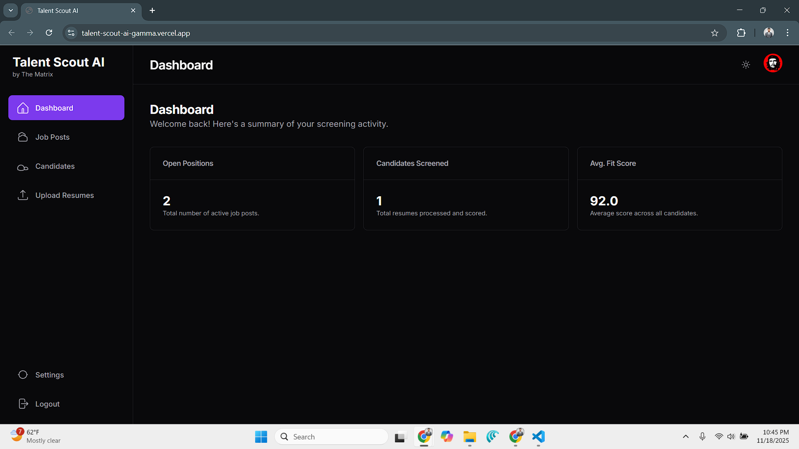
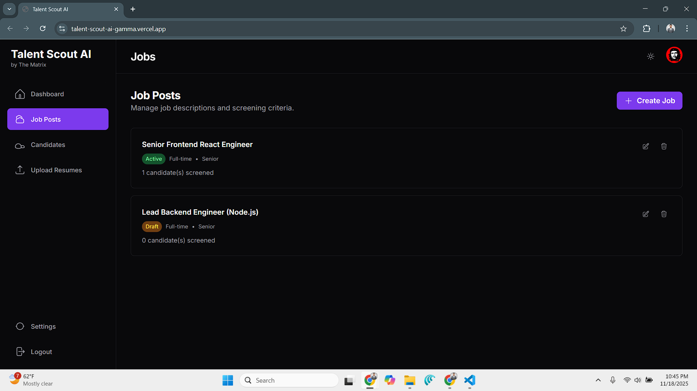
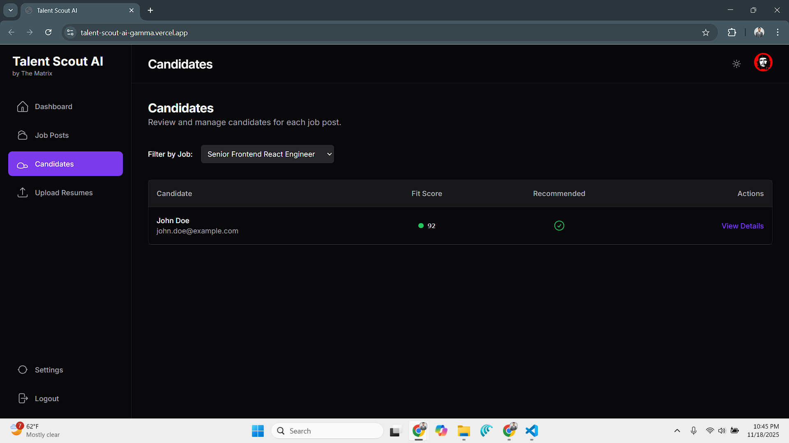
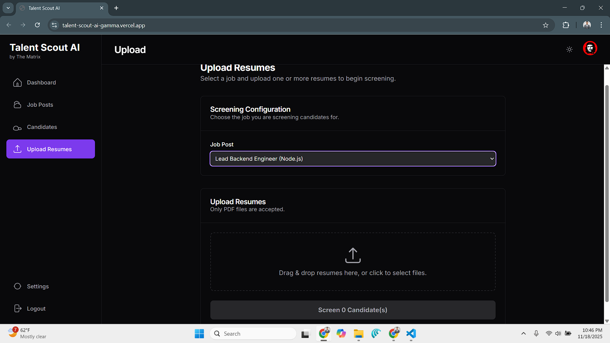
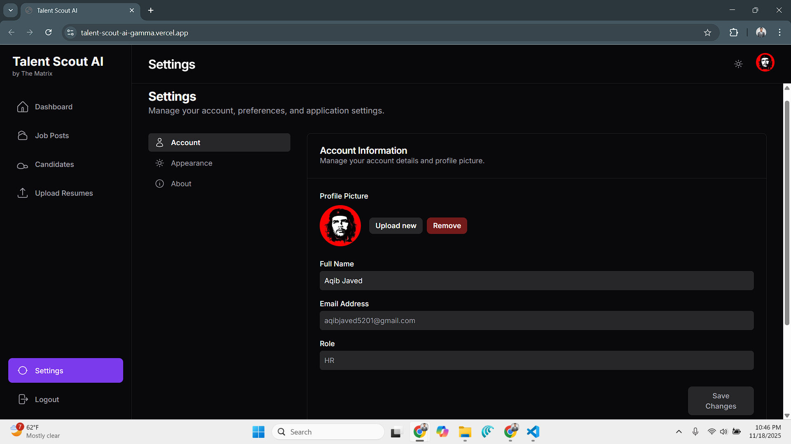

# 🚀 AI-Powered Resume Screening & Job Matching System

A smart hiring assistant that evaluates resumes, extracts skills, and matches candidates to job roles using **Google Gemini** and a **modern HR dashboard**.

---

## 📚 Table of Contents

1. [Overview](#-overview)
2. [Features](#-features)
3. [How It Works](#-how-it-works)
4. [Tech Stack](#-tech-stack)
5. [Project Structure](#-project-structure)
6. [Setup Instructions](#-setup-instructions)
7. [Deployment](#-deployment)
8. [Screenshots](#-screenshots)
9. [Future Enhancements](#-future-enhancements)
10. [Contributors](#-contributors)
11. [License](#-license)

---

## 📌 Overview

The **AI-Powered Resume Screening & Job Matching System** automates resume evaluation using **Google Gemini**.
It parses resumes, extracts skills, scores candidates based on job requirements, and displays results in an intuitive HR dashboard.

This system minimizes manual effort, reduces bias, and helps teams quickly identify top candidates.

---

## ✨ Features

### 🔹 AI Resume Parsing & Skill Extraction

* Extracts education, experience, technical stack, strengths, and weaknesses.
* Works with PDFs, images, and text using **Google Gemini**.

### 🔹 Job Configuration Module

* HR users can create custom job roles.
* Define required skills, descriptions, weightages, and scoring criteria.

### 🔹 Candidate Screening Dashboard

* Ranks candidates for each job.
* Provides visual match scores, summaries, and resume previews.

### 🔹 Modern UI (Light & Dark Themes)

* Minimal, responsive HR dashboard.
* Theme persistence across sessions.

### 🔹 Secure Authentication

* Only HR users can create jobs or screen candidates.
* Protected routes and role-based access.

### 🔹 Supabase Backend Integration

* Secure file storage (resumes).
* Real-time jobs & candidate data.
* Edge functions for AI processing.

---

## 🧠 How It Works

1. **HR creates a job post**
   → defines required skills and scoring rules

2. **Candidate uploads a resume**
   → Gemini parses and extracts structured data

3. **AI scoring engine evaluates the candidate**
   → calculates match scores, strengths, weaknesses

4. **Dashboard displays ranked candidates**
   → HR views insights, match graphs, and resume previews

---

## 🏗️ Tech Stack

### Frontend

* Next.js / TypeScript
* TailwindCSS-inspired custom UI
* Google Gemini AI Studio (UI Build)

### Backend

* Edge Functions (AI scoring logic)
* Google Gemini API

### AI

* Google Gemini 2.5 Flash
* Gemini Pro for resume parsing & evaluation

---

## 📁 Project Structure

```
/src
  /components
  /layouts
  /pages
  /services
  /contexts
  /utils
  /styles

/functions
  processCandidate.js

/public
```

---

## 🔧 Setup Instructions

### 1️⃣ Clone the Repository

```bash
git clone https://github.com/AqibNiazi/talent_scout_ai
cd talent_scout_ai
```

### 2️⃣ Install Dependencies

```bash
npm install
```

### 3️⃣ Add Environment Variables

Create a `.env` file:

```
API_KEY=your_api_key_here
```

### 4️⃣ Run Locally

```bash
npm run dev
```

### 5️⃣ Build for Production

```bash
npm run build
```

---

## 🌐 Deployment

Live Demo: **Vercel**
👉 [https://talent-scout-ai-gamma.vercel.app/](https://talent-scout-ai-gamma.vercel.app/)

---

## 📸 Screenshots

### Dashboard


### Job Post


### Candidates


### Upload Resume


### Profile


---

## 🎯 Future Enhancements

* Multi-role HR team support
* AI-generated interview questions
* Side-by-side candidate comparison
* ATS API integration
* Advanced keyword search & filters

---

## 🤝 Contributors

**Team: The Matrix**

* Muhammad Aqib Javed
* Shafqat Hussain (shafqathussain00)
* Sarah Khan

---

## 📄 License

MIT License – free to use and improve.

